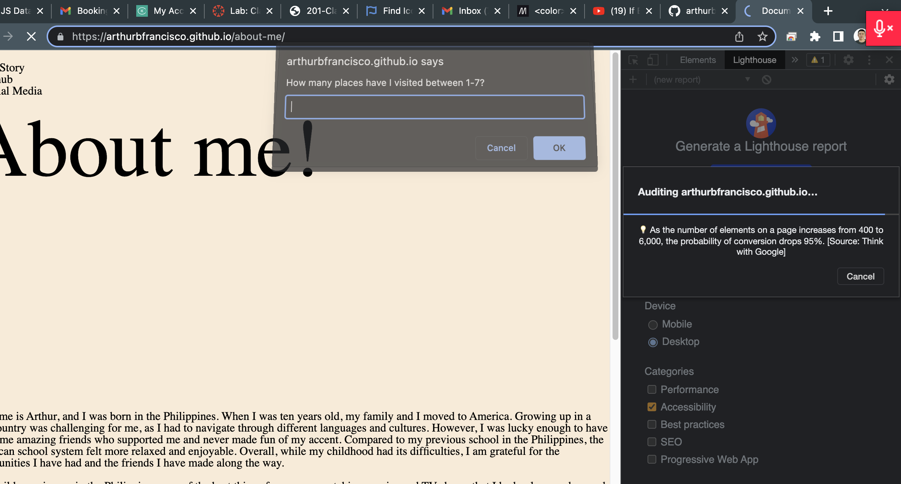
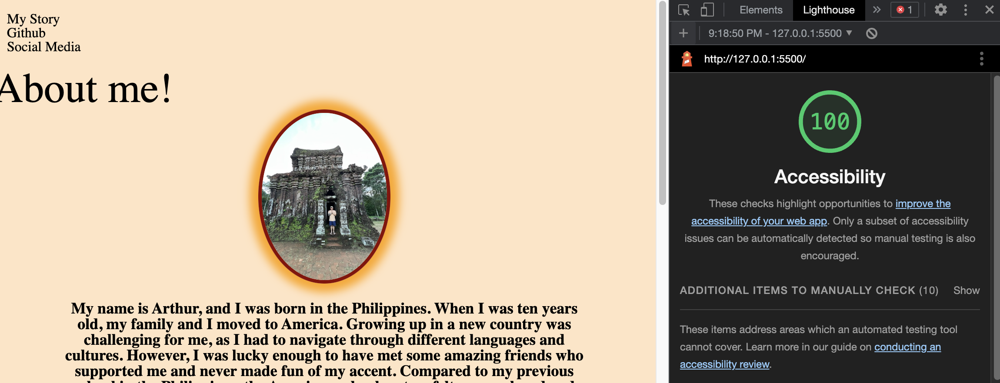
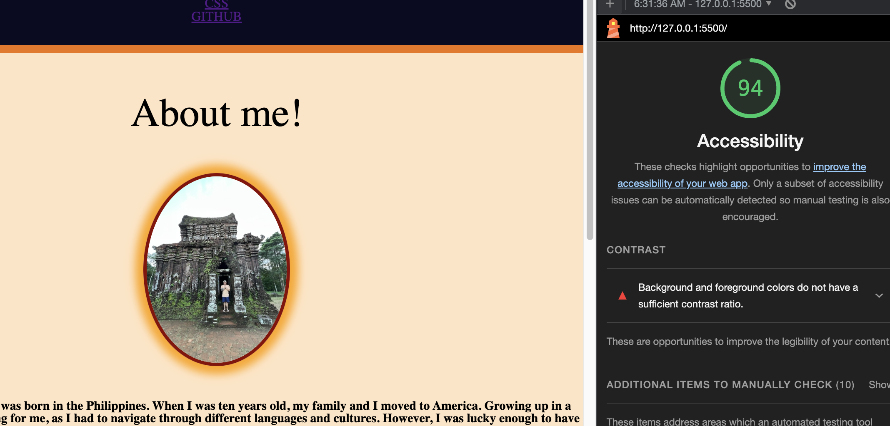
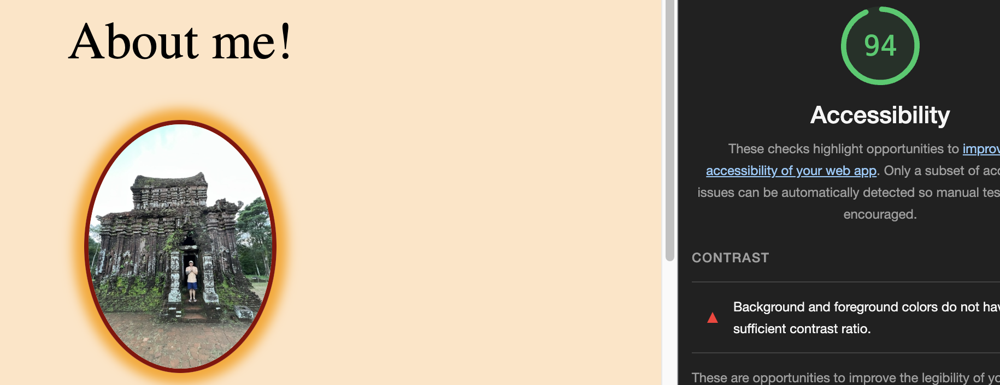

# LAB - 02

## About-me

About me project: Keep track of work progress and note taking skill.

### Author, Arthur B. Francisco

#### lab04
Driver Dan
navigator arthur

### Links and Resources

* [submission PR](http://xyz.com)
* Any Links you used as reference

### Lighthouse Accessibility Report Score

* [Lab01:](img.)
* 
* 
* 
* 
* [Lab06:](link)
* [Lab07:](link)
* [Lab08:](link)
* [Lab09:](link)
* [Lab10:](link)
* [Lab11:](link)
* [Lab12:](link)
* [Lab13:](link)
* [Lab14:](link)
* [Lab15:](link)
* [Lab16:](link)
* [Lab17:](link)
* [Lab18:](link)
* [Lab19:](link)
* [Lab20:](link)

* Provide a screenshot of your score after running a Lighthouse Accessibility report.

### Reflections and Comments:

* Lab 01:Hard
* Lab 02:Tough
* Lab 03:Frustrating
* Lab 04:Awful Day
* Lab 05:
* Lab 06:
* Lab 07:
* Lab 08:
* Lab 09:
* Lab 10:
* Lab 11:
* Lab 12:
* Lab 13:
* Lab 14:
* Lab 15:
* Lab 16:
* Lab 17:
* Lab 18:
* Lab 19:
* Lab 20:

